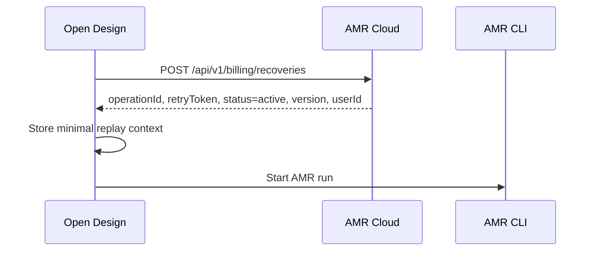
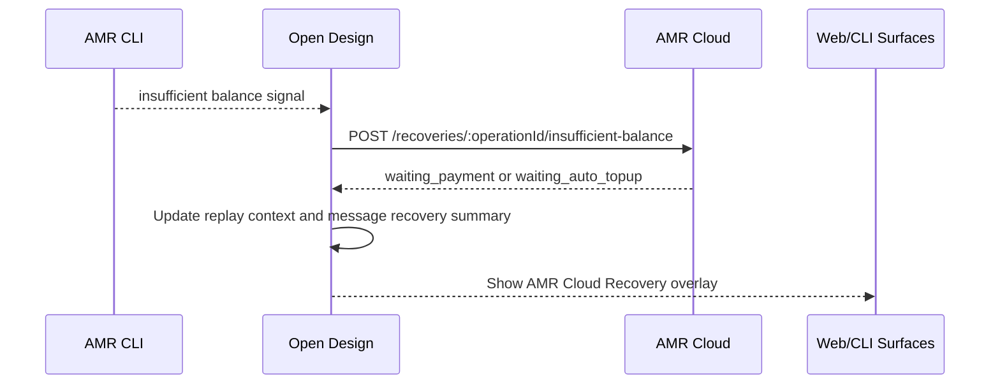
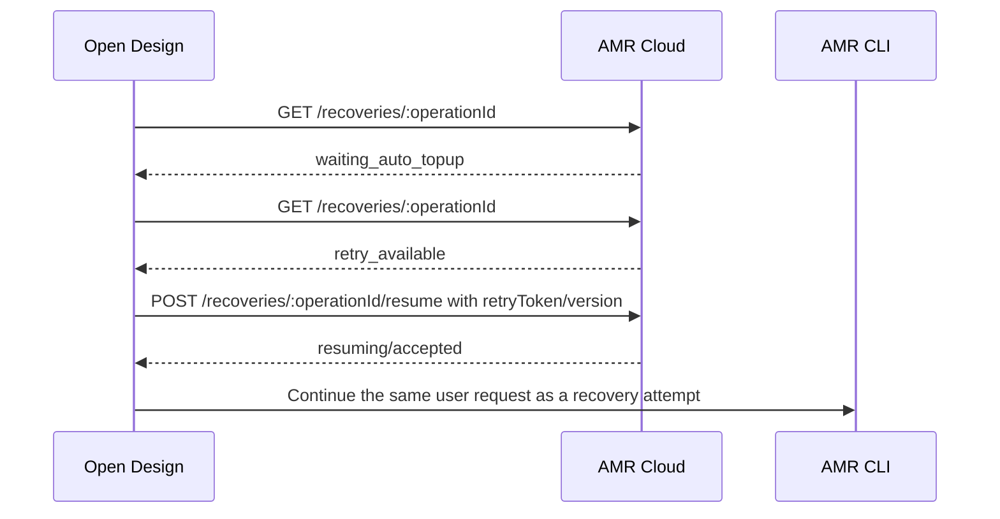
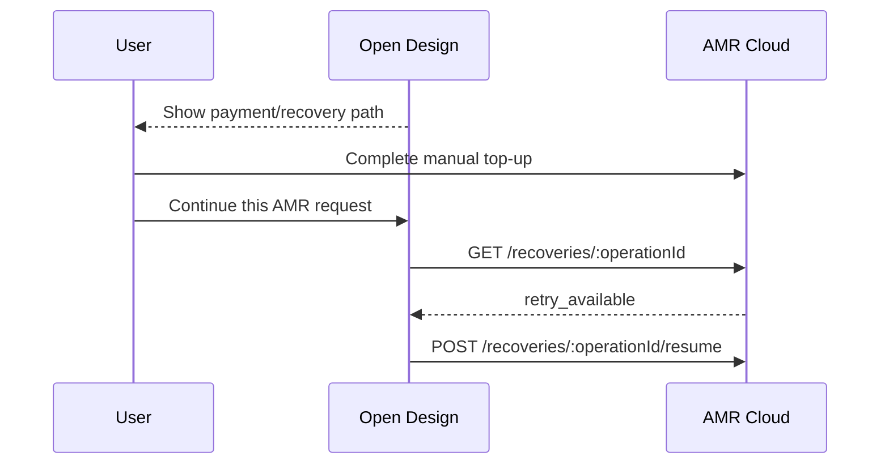

# AMR Cloud Recovery

## Purpose

AMR Cloud Recovery is the Open Design continuity path for an AMR Cloud run that
pauses because AMR Cloud billing requires balance readiness before the request
can continue.

This spec turns the recovery handoff into Open Design product and engineering
requirements. It follows the domain language in
[`CONTEXT.md`](../../CONTEXT.md) and the architectural decision in
[`docs/adr/0002-amr-cloud-recovery-continuity.md`](../../docs/adr/0002-amr-cloud-recovery-continuity.md).

## Problem Statement

Today Open Design treats AMR insufficient balance as a normal agent failure:
the run receives an `AMR_INSUFFICIENT_BALANCE` error and the user is sent to a
generic recharge URL. That loses the recovery operation that AMR Cloud/Vela can
provide: payment state, retry coordination, automatic top-up continuation, and
safe resume semantics.

Open Design must integrate with the AMR Cloud recovery contract without taking
ownership of AMR billing state and without turning local replay context into a
second task system.

## Goals

- Register AMR Cloud recovery operations before billable AMR Cloud runs begin.
- Pause a run into AMR Cloud Recovery when AMR Cloud reports insufficient
  balance.
- Automatically resume after automatic top-up when AMR Cloud marks the
  operation retryable.
- Require user-initiated recovery after manual top-up.
- Preserve recovery continuity across daemon restarts using minimal local
  replay context.
- Keep payment, balance, risk, refund, and dispute truth owned by AMR Cloud.
- Present recovery through the originating run, conversation, and existing run
  surfaces.
- Support multiple concurrent recovery operations without introducing a global
  recovery center.
- Make recovery visible through both web UI and `od run` CLI surfaces.
- Provide a restart path when the AMR Cloud operation is valid but the local
  run can no longer be resumed.
- Close or cancel pre-registered AMR Cloud operations on normal terminal paths
  so AMR Cloud does not retain stale active operations.

## Non-Goals

- Do not implement Open Design billing state, wallet balance state, payment
  checkout, refund handling, dispute handling, or risk resolution.
- Do not make AMR Cloud Recovery a generic run retry system.
- Do not expand the top-level `ChatRunStatus` union for the first version.
- Do not add a Recovery Center, global recovery inbox, or standalone recovery
  product surface.
- Do not store the original prompt, working directory, command arguments,
  environment, provider credentials, or full AMR Cloud payload in replay
  context.
- Do not let AMR Cloud call back into the user's local daemon to resume a run.
- Do not treat local recovery loss as payment failure.
- Do not auto-resume manual top-up operations without user action.

## Existing Context

### Current Open Design Behavior

- AMR runs use the local AMR CLI adapter behind the AMR Cloud product option.
- AMR insufficient balance is classified as `AMR_INSUFFICIENT_BALANCE`.
- The current user action is a generic recharge link.
- Run state is exposed through `ChatRunStatus` values:
  `queued`, `running`, `succeeded`, `failed`, and `canceled`.
- Run status is consumed broadly by the web UI, CLI, analytics, message
  persistence, and active-run recovery.

### Domain Decisions

- AMR Cloud Recovery is continuity for AMR Cloud, not Open Design billing
  ownership.
- Automatic top-up users auto-resume when AMR Cloud allows retry.
- Manual top-up users initiate recovery from Open Design after payment.
- AMR Cloud Recovery is bound to the AMR Cloud user that created the recovery
  operation.
- Risk, refund, and dispute blocks are not recovery states.
- Recovery appears through the originating run or conversation, not through a
  separate recovery center.
- Recovery state is an overlay attached to the run/message, not a new top-level
  run status.

## AMR Cloud Contract

Open Design consumes the AMR Cloud/Vela recovery contract. AMR Cloud remains the
source of truth for payment, balance readiness, automatic top-up, manual top-up,
risk blocking, refund guardrails, dispute guardrails, operation versioning, and
retry authorization.

### Required Endpoints

Open Design must integrate with these AMR Cloud endpoints:

```http
POST /api/v1/billing/recoveries
GET  /api/v1/billing/recoveries/:operationId
POST /api/v1/billing/recoveries/:operationId/insufficient-balance
POST /api/v1/billing/recoveries/:operationId/resume
POST /api/v1/billing/recoveries/:operationId/complete
POST /api/v1/billing/recoveries/:operationId/fail
POST /api/v1/billing/recoveries/:operationId/cancel
```

The exact request authentication and transport details belong to the AMR Cloud
integration layer. Open Design must not fork the payment state machine locally.

### Recovery Statuses

Open Design must understand these AMR Cloud recovery statuses:

| Status | Meaning for Open Design |
|---|---|
| `active` | Operation was registered but has not become user-visible recovery. |
| `waiting_payment` | Manual payment is required or in progress; show recovery payment path and wait for user action after top-up. |
| `waiting_auto_topup` | AMR Cloud is handling automatic top-up; Open Design may poll within bounded limits. |
| `retry_available` | AMR Cloud says the operation can be resumed. |
| `resuming` | A resume attempt is in progress. |
| `completed` | Operation finished successfully and local recovery context can be cleared. |
| `failed` | Operation cannot continue; local recovery context can be cleared or converted to restart guidance. |
| `canceled` | User no longer wants to continue this request; local recovery context can be cleared. |

### Recovery Modes

Open Design must distinguish automatic and manual recovery behavior:

| Mode | Trigger | Open Design behavior |
|---|---|---|
| Automatic top-up | AMR Cloud reports automatic top-up is active or waiting | Poll within bounded limits and resume automatically when `retry_available`. |
| Manual top-up | AMR Cloud requires user payment or manual top-up | Show a payment/recovery path and require user-initiated resume from Open Design after top-up. |
| Manual top-up required | AMR Cloud explicitly requires manual top-up | Never auto-resume. |

## Product Model

### User-Visible States

Open Design should present these user-facing recovery states as a run/message
overlay:

| Open Design state | Source status | User meaning |
|---|---|---|
| `recovering_waiting_payment` | `waiting_payment` | The request is paused until the user completes manual top-up. |
| `recovering_waiting_auto_topup` | `waiting_auto_topup` | Automatic top-up is in progress and Open Design is waiting to resume. |
| `recovering_retry_available` | `retry_available` | The request can be continued from Open Design. |
| `recovering_resuming` | `resuming` | Open Design is continuing the paused request. |
| `recovering_restart_available` | AMR Cloud operation valid but local run not resumable | The user can restart the request, but Open Design cannot continue the original local run. |
| `recovering_blocked` | risk, refund, dispute, wrong user, malformed context, or non-recoverable AMR response | The user must resolve the block or restart; Open Design must not imply payment failure. |

The names above are spec names, not required API enum names.

### Run Status Relationship

The top-level run status remains:

```ts
'queued' | 'running' | 'succeeded' | 'failed' | 'canceled'
```

AMR Cloud Recovery is represented as recovery metadata attached to:

- live run status responses;
- run SSE/error/diagnostic payloads where appropriate;
- the originating assistant message's persisted recovery summary.

User-facing UI must prefer the recovery overlay over generic failed-run copy
when a run has active or recoverable AMR Cloud Recovery state.

### Message Persistence

The originating assistant message should persist a recovery summary sufficient
to render the user's next action after the live daemon run expires.

The persisted summary may include:

- operation id;
- recovery status;
- recovery mode;
- whether user action is required;
- recovery or wallet URL;
- whether restart is available;
- user-facing block reason;
- timestamps relevant to display and expiry.

The persisted summary must not include prompt text, command data, environment,
credentials, or full AMR Cloud payloads.

## Local Replay Context

Open Design must store only the minimum local context needed to resume or
restart the recovery operation.

Allowed replay context fields:

- `operationId`;
- `retryToken`;
- `status`;
- `version`;
- `userId`;
- originating `runId`;
- originating `projectId`;
- originating `conversationId`;
- originating `assistantMessageId`;
- recovery mode;
- created, updated, and expiry timestamps.

Forbidden replay context fields:

- user prompt;
- current prompt;
- system prompt;
- working directory;
- command line;
- environment;
- provider credentials;
- AMR Cloud auth secrets;
- full AMR Cloud request or response payload;
- attached file contents.

Replay context is daemon-managed data and must derive from the daemon's resolved
data root. This spec deliberately does not define concrete filesystem paths;
follow root `AGENTS.md` → **Daemon data directory contract**.

## Required Flows

### 1. Pre-Register AMR Operation

Before starting a billable AMR Cloud run, Open Design must register a recovery
operation with AMR Cloud.



Pre-registration does not make recovery user-visible. If the run succeeds,
fails locally, or is canceled without a balance pause, Open Design must close
the AMR Cloud operation without showing AMR Cloud Recovery.

### 2. Pause on Insufficient Balance

When the AMR CLI or ACP session reports insufficient balance, Open Design must
pause the registered operation instead of only emitting a generic failure.



The recovery overlay must include a recovery URL shaped around the operation,
for example a wallet recovery destination with the operation id. The generic
wallet recharge URL is not enough for recovery.

### 3. Automatic Top-Up Recovery

For automatic top-up, Open Design may poll AMR Cloud within bounded limits.



Automatic recovery must be bounded. Repeated balance pauses, repeated resume
failures, or status polling exhaustion must surface a user-visible boundary
instead of looping indefinitely.

### 4. Manual Top-Up Recovery

For manual top-up, Open Design must wait for user initiation.



The manual continue action should make clear that continuing the request may
use AMR Cloud balance. It should not imply a free retry.

### 5. Daemon Restart Reconciliation

On daemon startup, Open Design must reconcile stored replay contexts:

- discard malformed contexts;
- discard terminal contexts after local cleanup;
- verify the current AMR Cloud user matches the context user;
- fetch current AMR Cloud status for valid non-terminal contexts;
- automatically resume only automatic top-up contexts that are retryable;
- show manual recovery affordances only after user action;
- convert locally non-resumable contexts into restart guidance.

Wrong-user contexts must not be resumed. They should either be hidden until the
correct AMR Cloud user returns or shown as requiring the correct account,
depending on the surrounding UI.

### 6. Cancel Recovery

Canceling recovery means the user no longer wants to continue that request. It
does not imply refund, payment reversal, or AMR Cloud balance change.

If the AMR Cloud operation is non-terminal, Open Design must best-effort call
the cancel endpoint. If AMR Cloud cancel fails, Open Design may stop local
waiting but must not claim the AMR Cloud operation was canceled.

### 7. Terminal Cleanup

Open Design must mark the AMR Cloud operation terminal when the originating run
or recovery attempt reaches a terminal condition:

| Local outcome | AMR Cloud terminal action |
|---|---|
| Run/recovery succeeds | `complete` |
| Run fails after entering recovery | `fail` |
| Pre-registered run fails before user-visible recovery | `fail` |
| User cancels run or recovery | `cancel` |
| Operation already terminal in AMR Cloud | No-op locally except cleanup |

Terminal cleanup must clear local replay context when it is no longer needed.

## Blocked and Restart Paths

### Local Run No Longer Resumable

When AMR Cloud says the operation can continue but Open Design no longer has
enough local context to continue the original local run, the product state is
restart available.

Open Design must not describe this as:

- payment failure;
- AMR Cloud failure;
- refund/dispute status;
- generic agent crash.

### Risk, Refund, and Dispute Blocks

Risk, refund, and dispute guardrails are AMR Cloud blocks, not AMR Cloud
Recovery states. Open Design may surface account or support guidance, but it
must not show a recovery resume affordance unless AMR Cloud explicitly returns
a recoverable status.

## Surfaces

### Web UI

The web UI must show AMR Cloud Recovery through the originating assistant
message/run area:

- payment required state;
- automatic top-up waiting state;
- manual continue action;
- resuming state;
- restart available state;
- canceled or blocked state;
- link to the AMR Cloud recovery wallet path when payment is required.

The web UI must not add a global recovery center in the first version.

### CLI

The `od` CLI must expose recovery through existing run surfaces:

- `od run info` should include recovery overlay fields when present.
- `od run watch` should show recovery transitions and terminal outcome.
- A standalone `od recovery` command is not required for the first version.

If a future standalone recovery command is added, it must not become the only
surface for recovery.

### API and Contracts

Shared contracts should add AMR Cloud Recovery metadata to run and message
shapes instead of changing the top-level run status union.

The recovery metadata should be safe for both web and CLI callers and should
exclude secrets and full AMR Cloud payloads.

### Analytics and Observability

Open Design should distinguish:

- pre-registered operation closed without user-visible recovery;
- balance pause entered;
- waiting manual payment;
- waiting automatic top-up;
- automatic resume attempted;
- manual resume attempted;
- restart path shown;
- recovery canceled;
- recovery completed;
- recovery failed or blocked.

Analytics must not require storing forbidden replay fields.

## Acceptance Criteria

- An AMR run registers an AMR Cloud recovery operation before the AMR CLI starts
  the billable run.
- A successful AMR run completes the AMR Cloud operation and clears local replay
  context.
- A local AMR runtime failure before balance pause closes the AMR Cloud
  operation without showing AMR Cloud Recovery.
- An insufficient-balance signal pauses the operation and shows AMR Cloud
  Recovery instead of only generic recharge guidance.
- Manual top-up shows a recovery payment path and requires a user action from
  Open Design before resume.
- Automatic top-up can resume automatically after AMR Cloud returns
  `retry_available`.
- `manualTopupRequired` never auto-resumes.
- Resume uses AMR Cloud operation versioning and retry token semantics.
- Missing retry token in a read response does not erase a previously stored
  retry token from create or pause responses.
- Wrong-user replay context does not resume.
- Malformed replay context does not resume.
- Terminal AMR Cloud operations are cleaned locally.
- Multiple recovery operations can exist concurrently.
- Repeated automatic recovery attempts are bounded.
- Local non-resumability produces restart guidance, not payment-failure copy.
- Risk/refund/dispute responses do not show recovery resume affordances.
- Canceling recovery best-effort cancels the AMR Cloud operation and never
  implies refund or payment reversal.
- Run status responses expose recovery overlay data without adding a top-level
  `ChatRunStatus`.
- The originating assistant message persists enough recovery summary to render
  recovery or restart context after live run expiry.
- `od run info/watch` can show recovery state.

## Test Plan

### Unit Tests

Add focused daemon integration tests for AMR Cloud Recovery:

- register operation and store minimal replay context;
- reject forbidden replay context fields;
- preserve retry token when later read responses omit it;
- discard malformed context;
- refuse wrong-user resume;
- clear terminal context;
- map AMR Cloud statuses to Open Design recovery overlay states;
- enforce manual top-up user initiation;
- enforce automatic top-up bounded polling;
- enforce bounded resume attempts;
- map local non-resumable context to restart guidance;
- map risk/refund/dispute responses to blocked guidance.

### Run Integration Tests

Cover AMR run lifecycle behavior:

- success completes pre-registered operation;
- local pre-recovery failure fails pre-registered operation without recovery UI;
- insufficient balance pauses and persists recovery summary;
- automatic top-up resumes;
- manual top-up waits for user action;
- cancel best-effort cancels AMR Cloud operation;
- daemon restart reconciles active contexts.

### Contract Tests

Cover shared run/message DTOs:

- recovery overlay is present when expected;
- top-level `ChatRunStatus` remains unchanged;
- recovery DTOs contain no forbidden fields;
- example payloads include web/CLI-safe recovery metadata.

### UI/CLI Tests

Cover user surfaces:

- assistant message renders payment required, waiting auto top-up, continue,
  resuming, restart, blocked, and canceled states;
- manual continue copy makes AMR Cloud balance usage clear;
- generic failed-run copy is not shown when recovery overlay is active;
- `od run info` prints recovery metadata;
- `od run watch` prints recovery transitions.

## Implementation Shape

Implement as a vertical slice before any broad directory reorganization:

1. Add AMR Cloud Recovery contracts and DTOs.
2. Add a deep daemon integration module for AMR Cloud Recovery.
3. Add minimal replay-context persistence under the daemon data-root contract.
4. Hook AMR run pre-registration into the run start path.
5. Hook insufficient-balance pause into the existing AMR account failure path.
6. Add bounded polling and resume behavior for automatic top-up.
7. Add manual continue behavior for manual top-up.
8. Add terminal cleanup for success, failure, and cancel.
9. Add startup reconciliation.
10. Add run overlay and assistant message persisted summary.
11. Add web and CLI presentation.
12. Add tests from this spec.

The integration module should hide AMR Cloud recovery state-machine details from
the general run orchestration path. `server.ts` should receive narrow hooks, not
inline the full recovery workflow.

## Open Questions

None for the first implementation slice. Future work may revisit:

- whether a global recovery inbox is warranted after real usage;
- whether AMR Cloud blocks deserve a separate domain term;
- whether recovery should become a first-class run status if multiple runtime
  families adopt the same continuity model.
